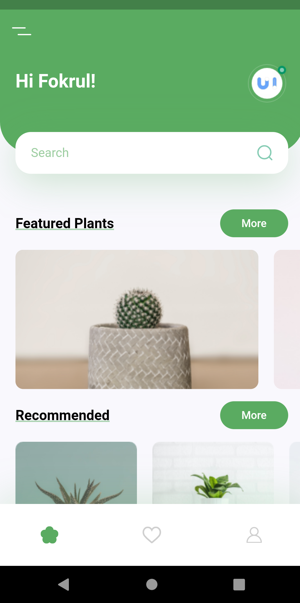
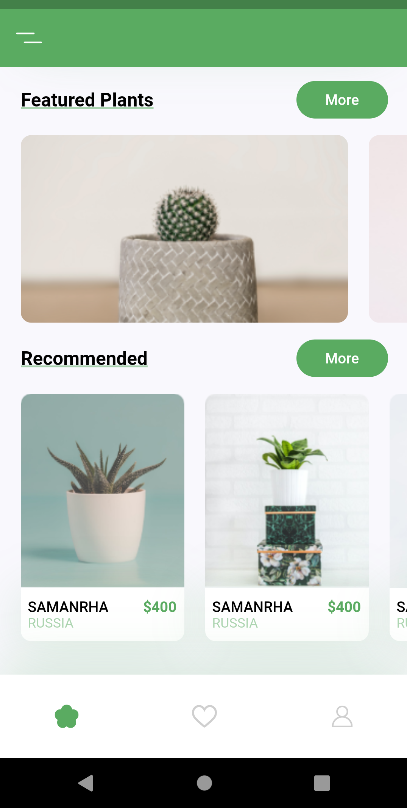

# plant_now

A new Flutter project.

## Getting Started

1. Download and install android studio.
2. run android sdk.
3. run the lib/main code.

## Features

1. Material design
2. custom components

## screenshots

